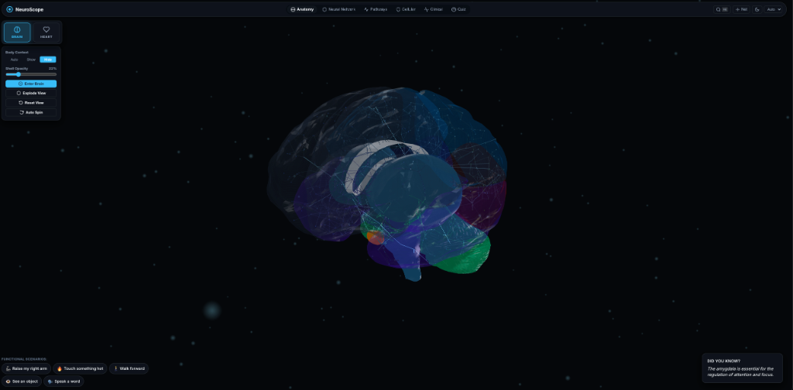

# NeuroScope — Interactive 3D Neuroanatomy & Cardiovascular Laboratory

NeuroScope is a premium, web-based interactive biology laboratory designed for medical students, neuroscience students, educators, and anatomy enthusiasts. It combines floating 3D human brain and anatomical heart visualizations with deterministic neural signaling engines, cardiac lumen blood-flow dynamics, pathway graph visualization, cellular action-potential/synapse simulators, clinical lesion localization mode, and active recall study quizzes.

---

## 📸 Interface Showcase



---

## 🌟 Key Features

### 1. 🧠 Floating 3D Neuroanatomy Engine (Three.js)
- **Comprehensive Brain Anatomy**: Interactive 3D human brain with distinct anatomical structures (Frontal Lobe, Parietal Lobe, Temporal Lobe, Occipital Lobe, Wernicke's & Broca's areas, Insula, Thalamus, Basal Ganglia, Hippocampus, Corpus Callosum, Cerebellum, Brainstem, Pyramidal Decussation, Cervical/Lumbar Spinal Cord, Brachial Plexus, Peripheral Nerves, Neuromuscular Junction, Nociceptors).
- **Cortex Opacity Control**: Real-time opacity adjustment (0%–100%) revealing deep subcortical nuclei.
- **Exploded View Mode**: Animated spatial separation of cortical lobes, deep nuclei, brainstem, and cerebellum.
- **GSAP Camera Traversal**: Smooth target focusing on selected anatomical structures.

### 2. 🫀 Anatomical 3D Heart & Vessel Lumen Flow Engine
- **Authentic Heart Geometry**: Realistic asymmetric human anatomical heart silhouette with detailed Left/Right Ventricles, Interventricular Septum, Left/Right Atria with auricle appendages, Ascending Aorta & Arch, Pulmonary Trunk & Arteries, Superior/Inferior Vena Cava, Coronary Arteries, and Cardiac Valves.
- **Restrained Medical Palette**: Cool translucent blue-gray tonal palette (`#A7B4C2`, `#8FA0B2`, `#B8C3CE`, `#A1AFBC`, `#91A2B3`, `#B4BEC8`, `#9EADB9`, `#899AA9`, `#D4DBE2`, `#C1CAD3`, `#667686`) with 20%–65% opacity.
- **Cardiovascular Blood Flow**: Vessel-contained lumen fluid flow visualization smoothly propagating through heart chambers and connected major vessels.

### 3. ⚡ Neural Signal Propagation & Flagship Scenarios
- **Luminous Energy Signals**: Energy packets traveling along 3D CatmullRom splines with regional node emissive pulses.
- **Core Scenarios**:
  - **Raise my right arm**: Motor cortex planning → Pyramidal decussation → Spinal cord → Neuromuscular junction.
  - **Walk forward**: Motor intention + Basal Ganglia gait gating + Cerebellar coordination.
  - **Touch something hot**: Nociceptors → Withdrawal reflex arc + Spinothalamic pain pathway to S1.
  - **See an object**: Phototransduction → Optic chiasm decussation → LGN → Visual Cortex V1.
  - **Speak a word**: Wernicke's comprehension → Arcuate fasciculus → Broca's speech planning → Vocal muscle execution.

### 4. ⏱️ Deterministic Simulation Timeline
- Interactive horizontal scrubber track with stage markers, play/pause, replay, 0.1x–4.0x speed control, and live stage explanation text.

### 5. 🔬 Cellular Scale & Micro-Exploration
- **3D Neuron & Synapse Model**: Soma, Dendrites, Axon hillock, Myelin sheath, Nodes of Ranvier, Axon terminal.
- **Action Potential Oscilloscope**: Real-time voltage curve (-70mV to +40mV) synced with ion channel ($Na^+$, $K^+$) kinetics.
- **Synaptic Exocytosis**: Neurotransmitter dynamics for Glutamate, GABA, Dopamine, and Acetylcholine.

### 6. 🩺 Clinical Mode & Active Recall Quizzes
- **Clinical Case Vignettes**: MCA stroke, Parkinson's disease, Cerebellar ataxia with 3D lesion localization challenges.
- **Active Recall Quizzes**: Structure identification, pathway ordering, and instant scoring feedback.
- **Cmd+K Global Search**: Instant searching across anatomy, pathways, functions, and clinical terms.
- **Dual Visual Themes**: Dark Theme (`#05070A`) with spatial ambient particles and Scientific Light Theme (`#F8F9FA`).

---

## 🛠️ Project Setup & Commands

```bash
# Install dependencies
npm install

# Start Vite development server
npm run dev

# Build production bundle
npm run build

# Preview production build
npm run preview
```

---

## 🏗️ Architecture & Directory Structure

```text
HumanBrain/
├── index.html                      # Layout, modals, panels, timeline HTML shell
├── package.json                    # Dependencies (three, gsap, vite)
├── vite.config.js                  # Vite configuration
├── public/
│   └── showcase.png                # Platform interface showcase screenshot
├── src/
│   ├── main.js                     # Master application bootstrapper & orchestrator
│   ├── style/                      # Design tokens, CSS components, responsive styles
│   ├── scene/                      # Three.js WebGLRenderer, camera controls, lighting, body context
│   ├── anatomy/                    # Asset registries, Brain & Heart 3D model builders, exploded view
│   ├── cardiac/                    # Cardiac blood flow system & vessel lumen shaders
│   ├── simulation/                 # EventBus, timeline clock engine, signal particle systems
│   ├── pathways/                   # Pathway 3D graphs, Bezier curve rendering & pulse nodes
│   ├── cellular/                   # 3D Neuron & Synapse scene, action potential oscilloscope
│   ├── data/                       # Anatomy data, pathways, scenarios, clinical cases, quiz questions
│   ├── ui/                         # Navigation, controls, timeline, search modal, clinical & quiz UI
│   └── utils/                      # Performance monitor (Shift+D)
```

---

## ⚕️ Educational Disclaimer
NeuroScope provides conceptual medical visualizations for education and neuroanatomy study. It is intended for educational purposes and does not model every individual biological neuron or clinical diagnostic scenario.
